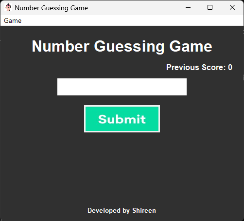
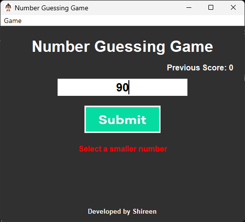
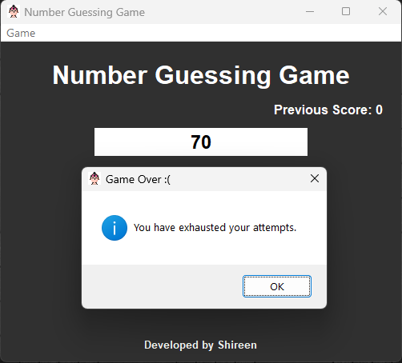

# Number Guessing Game

This is a Python-based number guessing game built with Tkinter for the GUI. The game challenges the player to guess a randomly generated number between 1 and 100 within ten attempts.

## How to Play
1. Run the `number_guessing_game.py` script.
2. Enter your guess in the input box.
3. Click the submit button or press the Enter key.
4. The game will provide hints if your guess is higher or lower than the target number.
5. You have 10 attempts to guess the number correctly.

## Files in the Repository
- `number_guessing_game.py`: The main script for the game.
- `button.jpg`: Image used for the submit button.
- `guess.png`: Icon image for the game window.
- `score.txt`: File to store the score of the previous game.

## Requirements
- Python 3.x
- Tkinter
- Pillow

## Installation
Install the necessary packages using:
```bash
pip install tkinter pillow

## Screenshots




## About
Developed by Shireen